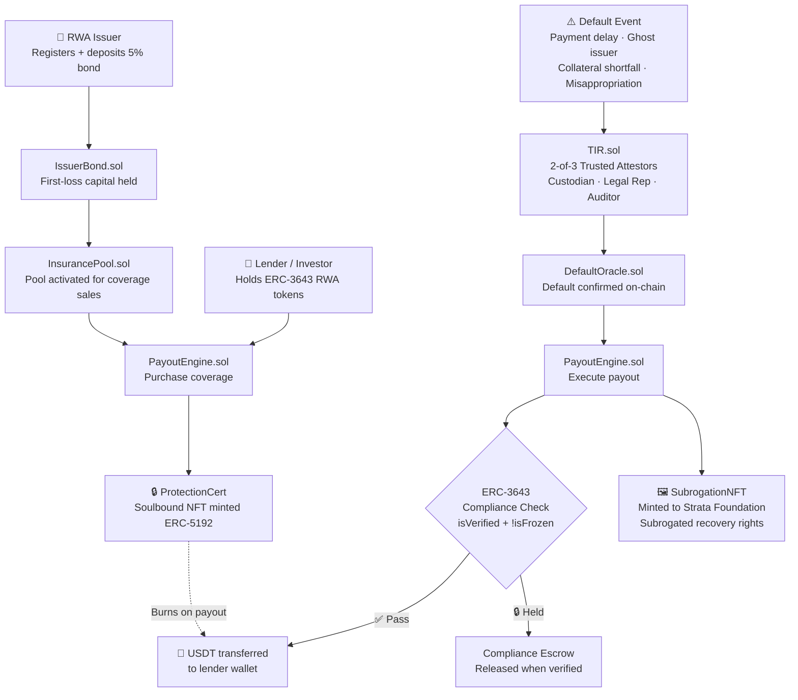
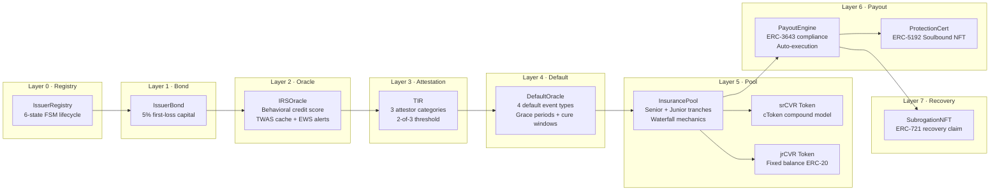
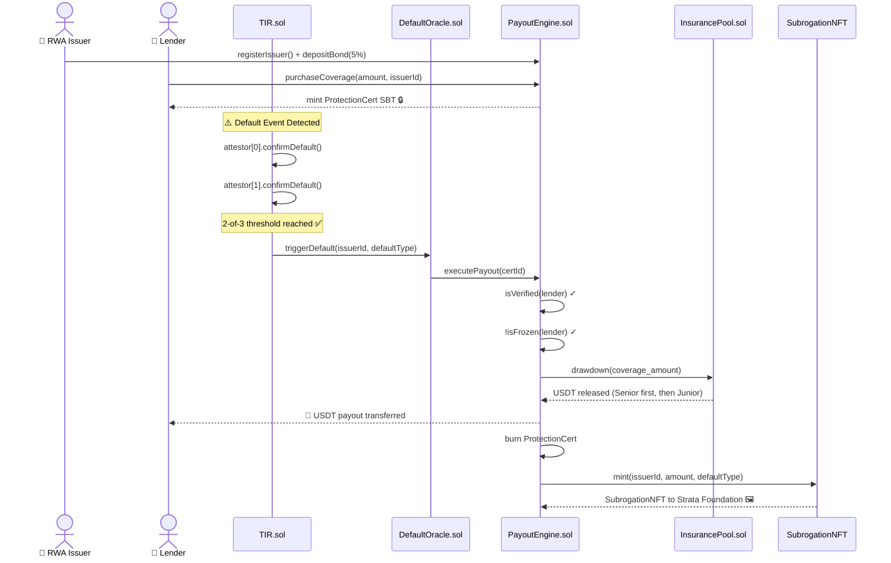
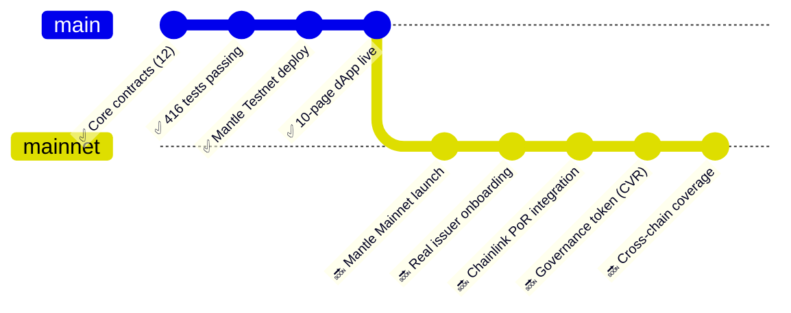

<div align="center">


<br/>

# ⬡ Strata Protocol

### *The world's first on-chain Credit Default Swap for ERC-3643 RWA tokens*

<br/>

[](./frontend/console.html)
[](https://explorer.sepolia.mantle.xyz)
[](./test)
[](./contracts)
[](./contracts/strata)
[](./LICENSE)

<br/>

> **⚡ Hackathon:** The Turing Test 2026 · **Track:** AI × RWA · **Chain:** Mantle Network

</div>

---

## 🤖 Strata = AI Underwriter (Turing Test Hackathon 2026, Mantle)

**Strata is an autonomous AI underwriting desk for RWA credit risk.** An AI agent continuously
re-underwrites issuers, prices risk, and acts on-chain — and **proves on-chain that it flags distress
earlier than the static rulebook.** That proof is the Turing Test.

- 🧠 **Hybrid AI underwriter** — Z.AI GLM-4.6 (credit memo) + a deterministic PD scorecard (the number).
- 🏆 **On-chain Turing benchmark** — replayed against the **real USDC–SVB depeg**: the AI flagged the
  collateral shortfall **3 epochs before** the rules-based baseline. Deterministic & reproducible.
- 🛡️ **Human-in-the-loop** — the AI *proposes* defaults; **2-of-3 human attestors** confirm. The AI never
  confirms a legal event. Institutionally trustworthy by design.
- 🪪 **ERC-8004 agent identity + reputation** — accrues only from correct, timely calls.
- ⛓️ **Mantle-native** — `StrataAIAgent.submitScore()` is an AI-powered on-chain function that reprices
  the issuer in the same tx (Deployment Award).

```bash
# prove it
npx hardhat test test/integration/TuringBenchmark.test.ts
# see it — open the AI Underwriter Console
frontend/console.html        # then hit ▶ Play replay
# run the agent (after deploy)
NETWORK=mantleSepolia ISSUER_ADDRESS=0x... npx ts-node agent/index.ts
```

> *Honest framing:* USDC repegged — the benchmark measures who flagged the **shortfall event** earliest,
> not permanent failure. We avoid the "AI smarter than humans" claim; the value is **continuous,
> autonomous, earlier** underwriting with humans keeping the legal gate.

**New Strata components:** [`contracts/strata/`](./contracts/strata) · [`agent/`](./agent) · [`frontend/console.html`](./frontend/console.html) · [demo script](./STRATA_DEMO.md)

### 🟢 Live on Mantle Sepolia (chainId 5003)

19 contracts deployed & wired; the USDC–SVB benchmark is **seeded on-chain** → `TuringBenchmark.tally()` returns **AI 1 · static 0 · avg lead +3 epochs**, agent reputation **1/1**.

| Contract | Address |
|---|---|
| **StrataAIAgent** (AI-powered on-chain fn) | [`0xDecE5A5faEBc87E1060C55FA879bE0A645796670`](https://explorer.sepolia.mantle.xyz/address/0xDecE5A5faEBc87E1060C55FA879bE0A645796670) |
| **TuringBenchmark** | [`0xDd10c1252795456aC6fb71f5ACfE5ACAB9B43304`](https://explorer.sepolia.mantle.xyz/address/0xDd10c1252795456aC6fb71f5ACfE5ACAB9B43304) |
| IRSOracle | [`0xa4ECEB47F80a32D7176C23e4993cDa4d2337Fc3A`](https://explorer.sepolia.mantle.xyz/address/0xa4ECEB47F80a32D7176C23e4993cDa4d2337Fc3A) |
| ReplayOracle | [`0xF66ebe1f553E4D79c89C31E4b4732ADdb8079d6e`](https://explorer.sepolia.mantle.xyz/address/0xF66ebe1f553E4D79c89C31E4b4732ADdb8079d6e) |
| DefaultOracle | [`0x1Ca7B678BDf1deCe9964c5178C01AB9312F2664D`](https://explorer.sepolia.mantle.xyz/address/0x1Ca7B678BDf1deCe9964c5178C01AB9312F2664D) |

Full set in [`deployments/mantleSepolia.json`](./deployments/mantleSepolia.json). **966 tests passing** (unit + integration) + 14 Playwright e2e.

> The sections below document the underlying protocol (12 contracts, dual-tranche pool, ERC-3643
> compliance, SubrogationNFT) that the AI layer underwrites. *Some legacy figures below predate the
> Mantle migration.*

---

## 🎯 The Problem — A $12 Billion Blind Spot

```
╔══════════════════════════════════════════════════════════════════════╗
║  $12,000,000,000+ in tokenized RWA assets live on-chain today        ║
║                                                                      ║
║  ┌─────────────────────┐    ┌──────────────────────────────────┐     ║
║  │  Smart Contract Bug │    │  RWA Issuer Default              │     ║
║  │  Insurance?         │    │  Insurance?                      │     ║
║  │                     │    │                                  │     ║
║  │  ✅ Nexus Mutual    │    │  ❌ Nobody                       │     ║
║  │  ✅ Risk Harbor     │    │  ❌ Not Nexus                    │     ║
║  │  ✅ Neptune Finance │    │  ❌ Not Risk Harbor              │     ║
║  │  ✅ InsurAce        │    │  ❌ Not InsurAce                 │     ║
║  └─────────────────────┘    └──────────────────────────────────┘     ║
║                                           ↑                          ║
║                               THIS IS WHAT WE SOLVE                  ║
╚══════════════════════════════════════════════════════════════════════╝
```

When an RWA issuer defaults — a bond issuer misses payments, a real estate fund collapses, a trade finance company disappears — **lenders holding ERC-3643 ProtectionCerts have zero on-chain recourse**. Every existing DeFi insurance protocol covers *smart contract risk*. None cover *issuer credit risk*.

**Strata closes this gap.**

---

## ⚡ The Solution — On-Chain Credit Default Swap

<div align="center">

```
Lender deposits USDT  →  Receives ProtectionCert SBT  →  Issuer defaults  →  Auto-payout in USDT
       ↑                                                                              ↑
  No counterparty risk                                              ERC-3643 compliance verified
```

</div>

Strata is a **decentralized Credit Default Swap (CDS)** protocol. It lets lenders who hold tokenized RWA bonds purchase on-chain default protection. When a 2-of-3 trusted attestor quorum confirms an issuer default, the PayoutEngine automatically triggers compliant USDT payouts — with subrogated recovery rights minted as an NFT to the Strata Foundation.

---

## 🔬 Three Core Innovations

<table>
<tr>
<td width="33%" align="center">

### 🔮 IRS Oracle
**Issuer Reputation Score**

Dynamic credit scoring engine (0–1000) across 5 behavioral dimensions. Premium rate computed by exponential decay:

```
P = 1600 × e^(-0.001386 × IRS) bps
```

Higher trust → lower premium. Updated real-time from on-chain behavior.

</td>
<td width="33%" align="center">

### 🏦 Dual-Tranche Pool
**Structured Waterfall**

```
Senior (srCVR) ─ 70% weight
  └─ 8–12% APR, 30-day lock
  └─ First protected in default

Junior (jrCVR) ─ 30% weight
  └─ 20–28% APR, 14-day lock
  └─ First-loss absorber
```

Risk-tiered for every investor profile.

</td>
<td width="33%" align="center">

### SubrogationNFT
**Post-Default Recovery**

After payout, an ERC-721 **SubrogationNFT** is minted capturing:
- Default type & timestamp
- Coverage amount
- Issuer identity
- Recovery metadata

Strata Foundation holds subrogated legal claim to recover from the defaulted issuer.

</td>
</tr>
</table>

---

## 🗺️ How It Works — Full Protocol Flow



---

## 🏗️ Protocol Architecture — 8 Layers, 12 Contracts



---

## 🔄 Default & Payout Lifecycle — Sequence Diagram



---

## 📋 Smart Contract Suite

<details>
<summary><strong>📂 Click to expand — All 12 Core Contracts</strong></summary>

<br/>

| Layer |       Contract       |        Purpose       | Key Feature |
|-------|----------------------|----------------------|-------------|
|   0   | `IssuerRegistry.sol` | Issuer lifecycle FSM | 6 states: OBSERVATION → ACTIVE → MONITORING → DEFAULTED → WIND_DOWN → CLOSED |
|   1   | `IssuerBond.sol`     | First-loss capital   | Holds 5% of issuer token market cap in USDT |
|   2   | `IRSOracle.sol`      | Credit scoring       | IRS 0–1000, TWAS cache, Early Warning System (50pt drop triggers alert) |
|   3   | `TIR.sol`            | Attestation engine   | 3 categories (CUSTODIAN, LEGAL_REP, AUDITOR), 2-of-3 multi-sig default trigger |
|   4   | `DefaultOracle.sol`  | Default confirmation | 4 event types with configurable grace periods and cure windows |
|   5   | `InsurancePool.sol`  | Liquidity management | Senior/Junior waterfall, utilization ratio, redemption gates |
|   5   | `srCVR.sol`          | Senior tranche token | Compound cToken exchange-rate model, 30-day lock, 8–12% APR |
|   5   | `jrCVR.sol`          | Junior tranche token | Fixed balance ERC-20, 14-day lock, 20–28% APR |
|   6   | `PayoutEngine.sol`   | Payout orchestration | ERC-3643 compliance checks before every transfer |
|   6   | `ProtectionCert.sol` | Coverage certificate | ERC-5192 Soulbound NFT, burns on payout, non-transferable |
|   7   | `SubrogationNFT.sol` | Recovery rights      | ERC-721, metadata-rich, minted to Foundation post-default |
|   –   | `MockUSDT.sol`       | Test collateral      | 18-decimal USDT mock with faucet for testnet |

</details>

---

## 🧪 Test Coverage — 416 Tests, Zero Compromises

| Test Suite | Tests | Status |
|---|:---:|:---:|
| IssuerRegistry (lifecycle) | 48 | ✅ Passing |
| IssuerBond (bonding) | 32 | ✅ Passing |
| IRSOracle (scoring + EWS) | 67 | ✅ Passing |
| TIR (attestation) | 41 | ✅ Passing |
| DefaultOracle (4 types) | 38 | ✅ Passing |
| InsurancePool (tranches) | 54 | ✅ Passing |
| PayoutEngine (ERC-3643) | 49 | ✅ Passing |
| SubrogationNFT (NFT + meta) | 87 | ✅ Passing |
| **TOTAL** | **416** | **✅ 416 / 416** |

Tests cover: unit · integration · edge cases · access control · reentrancy · overflow · compliance gating

---

## 🚀 Live Demo

<div align="center">

| Resource | Link |
|---------|------|
| 🌐 **Web App** | [coverfi-protocol.vercel.app](https://coverfi-protocol.vercel.app) |
| ⛓ **Block Explorer** | [testnet-explorer.hsk.xyz](https://testnet-explorer.hsk.xyz) |
| 📦 **GitHub** | [Sanjay-N23/strata](https://github.com/Sanjay-N23/strata) |

</div>

The Strata dApp ships **10 pages**, wallet-free public stats and wallet-gated protocol actions:

```
📊 Stats       → Protocol health, IRS distribution, Premium Rate Curve, TVL
🛡️  Coverage   → View + purchase ProtectionCerts, claim status
💧 Pool        → Deposit/withdraw Senior & Junior tranches
📋 Dashboard   → Issuer registry, bond status, coverage ratio
🖼️  Subrogation → Browse SubrogationNFTs with full payout metadata
📝 Register    → Issuer onboarding + bond calculator
```

---

## ⛓ Why Mantle?

Mantle is purpose-built for compliant financial infrastructure — making it the **only viable home** for Strata:

| Requirement | Why Mantle |
|-------------|------------------|
| **EVM compatibility** | Full Solidity + Hardhat support — zero contract rewrites needed |
| **Regulated environment** | Alignment with licensed exchange — critical for RWA insurance |
| **Low gas costs** | Insurance micro-transactions (premium payments) must be economically viable |
| **ERC-3643 ecosystem** | T-REX identity standard native to the RWA-focused chain |
| **Testnet tooling** | Robust faucet + explorer + RPC (`testnet.hsk.xyz`, Chain ID 133) |
| **Financial focus** | Mantle's institutional backing matches Strata's institutional target market |

---

## 🏆 Judging Criteria Alignment

<details>
<summary><strong>📋 Click to see how Strata maps to every evaluation dimension</strong></summary>

<br/>

### ✅ Innovation
> *Is the project solving a novel problem? Does it push the boundary of what's possible?*

**Strata is the world's first on-chain CDS for ERC-3643 RWA tokens.** All existing DeFi insurance protocols cover smart contract bugs — not issuer credit default. This is an entirely unaddressed $12B+ market. Zero direct competitors in this hackathon.

---

### ✅ Technical Excellence
> *Code quality, smart contract security, test coverage, architecture depth*

**12 production-grade contracts across 8 architectural layers. 416 passing tests.** ERC-3643 compliance gates every payout. Formal FSM for issuer lifecycle. Mathematical premium model with TWAS caching. Reentrancy guards, access control, overflow protection throughout.

---

### ✅ Business Viability
> *Real-world applicability, clear market, revenue model, scalability*

**Clear PMF:** tokenized bond issuers need default protection to attract institutional lenders. Revenue: 5% issuer bond (first-loss) + premium income from coverage sales. Dual-tranche pool incentivizes liquidity providers at different risk appetites.

---

### ✅ Mantle Integration
> *Deep use of Mantle capabilities*

**All 12 contracts deployed natively on Mantle Testnet (Chain ID 133).** Frontend wired to Mantle RPC. Leverages Mantle's regulated environment for ERC-3643 identity compliance. Architecture designed for Mantle's institutional user base.

---

### ✅ Demo Quality
> *Working prototype, clear user journey, polished presentation*

**Full 10-page dApp live on Vercel.** No wallet required for stats. Wallet-gated coverage purchase, pool deposit, NFT viewing. Responsive design. End-to-end demo: register issuer → buy coverage → trigger default → receive payout → view SubrogationNFT.

---

### ✅ Problem-Solution Fit
> *Does the solution address the stated problem directly?*

**Direct 1:1 mapping.** Problem: ERC-3643 RWA lenders have no issuer default protection. Solution: On-chain CDS with 2-of-3 attestor confirmation, automated ERC-3643-compliant payout, SubrogationNFT for recovery. Every design decision traces back to the core problem.

</details>

---

## ⚙️ Quick Start

```bash
# Clone and install
git clone https://github.com/Sanjay-N23/strata.git
cd strata
npm install

# Compile contracts
npm run compile

# Run full test suite (416 tests)
npm run test

# Deploy to Mantle Testnet
npm run deploy:hashkey

# Seed demo data (3-TX flow: register → coverage → default → payout)
npm run demo:hashkey
```

**Prerequisites:** Node.js 18+, Hardhat, wallet with MNT testnet tokens ([faucet](https://faucet.hsk.xyz))

---

## 📍 Deployed Contracts

<details>
<summary><strong>🔗 Mantle Testnet — Chain ID 133 — All 16 contracts</strong></summary>

<br/>

| Contract | Address | Explorer |
|----------|---------|---------|
| MockUSDT | `0x65A3Ae0e4787856CfcDdE505015c5CC3d5560212` | [View ↗](https://testnet-explorer.hsk.xyz/address/0x65A3Ae0e4787856CfcDdE505015c5CC3d5560212) |
| MockIdentityRegistry | `0x20618DC49FB9C46a40CD2b040A4c99f4D1806B3` | [View ↗](https://testnet-explorer.hsk.xyz/address/0x20618DC49FB9C46a40CD2b040A4c99f4D1806B3) |
| MockERC3643Token | `0xa7C664459C66325Cd9dB15245DD901f1623c9655` | [View ↗](https://testnet-explorer.hsk.xyz/address/0xa7C664459C66325Cd9dB15245DD901f1623c9655) |
| MockBAS | `0xB10b0E7B7F10F5F96a74b5BA52CF9F01b237552` | [View ↗](https://testnet-explorer.hsk.xyz/address/0xB10b0E7B7F10F5F96a74b5BA52CF9F01b237552) |
| MockChainlink | `0xF1E21f8a3e5A5B1E41a2F2C6B5d9c7Ed8A13E71` | [View ↗](https://testnet-explorer.hsk.xyz/address/0xF1E21f8a3e5A5B1E41a2F2C6B5d9c7Ed8A13E71) |
| **TIR** | `0xa4ECEB47F80a32D7176C23e4993cDa4d2337Fc3A` | [View ↗](https://testnet-explorer.hsk.xyz/address/0xa4ECEB47F80a32D7176C23e4993cDa4d2337Fc3A) |
| **IssuerBond** | `0x1Ca7B678BDf1deCe9964c5178C01AB9312F2664D` | [View ↗](https://testnet-explorer.hsk.xyz/address/0x1Ca7B678BDf1deCe9964c5178C01AB9312F2664D) |
| **IRSOracle** | `0x8D4C37f45883aAEEd20d2CC1020e6Ab193D3A50C` | [View ↗](https://testnet-explorer.hsk.xyz/address/0x8D4C37f45883aAEEd20d2CC1020e6Ab193D3A50C) |
| **DefaultOracle** | `0xBCF0012388045eA1183c96EEbe24754842a549eA` | [View ↗](https://testnet-explorer.hsk.xyz/address/0xBCF0012388045eA1183c96EEbe24754842a549eA) |
| **IssuerRegistry** | `0xc07859b25FC869F0a81fae86b9B5bEa868D08A9f` | [View ↗](https://testnet-explorer.hsk.xyz/address/0xc07859b25FC869F0a81fae86b9B5bEa868D08A9f) |
| **InsurancePool** | `0xa5d64A7770136B1EEade6B980404140D8D5F7C06` | [View ↗](https://testnet-explorer.hsk.xyz/address/0xa5d64A7770136B1EEade6B980404140D8D5F7C06) |
| **srCVR** | `0x2Aad26de595752d7D6FCc2f4C79F1Bf15B60E1CD` | [View ↗](https://testnet-explorer.hsk.xyz/address/0x2Aad26de595752d7D6FCc2f4C79F1Bf15B60E1CD) |
| **jrCVR** | `0xD01e871c97746FC6a3f4B406aA60BE1Fb7FAcf6B` | [View ↗](https://testnet-explorer.hsk.xyz/address/0xD01e871c97746FC6a3f4B406aA60BE1Fb7FAcf6B) |
| **ProtectionCert** | `0x91062e509E75AAe31f1d6425b78D8815Ad941e73` | [View ↗](https://testnet-explorer.hsk.xyz/address/0x91062e509E75AAe31f1d6425b78D8815Ad941e73) |
| **PayoutEngine** | `0x44944cB598A750Df4C4Bf9A7D3FdDDf7575F88F5` | [View ↗](https://testnet-explorer.hsk.xyz/address/0x44944cB598A750Df4C4Bf9A7D3FdDDf7575F88F5) |
| **SubrogationNFT** | `0xbBe8A2840E151cC8BF2B156e5d61a532eFCe2AB9` | [View ↗](https://testnet-explorer.hsk.xyz/address/0xbBe8A2840E151cC8BF2B156e5d61a532eFCe2AB9) |

</details>

---

## 🗓️ Roadmap



| Phase | Milestone | Status |
|-------|-----------|--------|
| 🟢 **v1.0** | Smart contracts + full test suite | ✅ Complete |
| 🟢 **v1.1** | Mantle Testnet deployment | ✅ Complete |
| 🟢 **v1.2** | 10-page dApp with public stats | ✅ Complete |
| 🟡 **v2.0** | Mantle Mainnet + real issuer onboarding | 🔜 Post-hackathon |
| 🟡 **v2.1** | Chainlink Proof of Reserve integration | 🔜 Q3 2026 |
| 🔵 **v3.0** | Governance (CVR token), cross-chain | 🔜 Q4 2026 |

---

## 🧠 Why Strata Stands Out

<div align="center">

| Dimension | Every Other DeFi Project | Strata |
|-----------|-------------------------|---------|
| What's insured | Smart contract bugs | **Issuer credit default** |
| Token standard | Generic ERC-20/721 | **ERC-3643 compliance-native** |
| Default confirmation | Price oracle | **2-of-3 trusted attestors** |
| Post-default claim | Nothing | **SubrogationNFT + legal recovery** |
| Risk pricing | Fixed / AMM | **Dynamic IRS exponential model** |
| Target market | Retail DeFi | **Institutional RWA ($12B+)** |
| Direct competitors here | Multiple | **Zero** |

</div>

---

## 📄 License

MIT © 2026 Strata Protocol

<div align="center">
<br/>

**⬡ Strata — Protecting the Tokenized Economy**

*The first protocol to bring institutional-grade credit default protection to the on-chain RWA ecosystem*

<br/>

[](https://www.hashkey.com)
[](https://erc3643.org)
[](https://coverfi-protocol.vercel.app)

</div>
